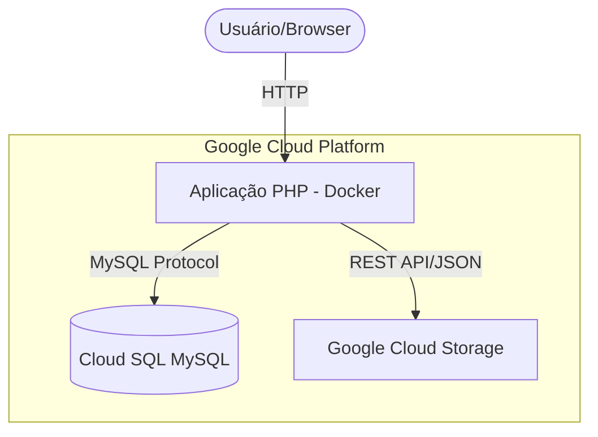

# 📋 Integração Cloud: Storage & Banco de Dados (GCP)

Este repositório contém a entrega da **Atividade 4.1** da disciplina de **Computação em Nuvem II**. A aplicação demonstra a integração prática entre um ambiente local (Docker) e serviços gerenciados na nuvem pública (**Google Cloud Platform**).

**Identificação:**
- **Aluno:** Cassia Voltolin
- **Disciplina:** Computação em Nuvem II (ISW035)
- **Professor:** Ronan Adriel Zenatti
- **FATEC Jahu**

---

## 1. Descrição do Projeto
A aplicação foi desenvolvida em **PHP Puro (v8.2)** e utiliza o SDK oficial do Google Cloud para gerenciar arquivos em um bucket e o driver PDO para interagir com uma instância gerenciada do MySQL (Cloud SQL).

**Funcionalidades:**
- **MySQL (Cloud SQL):** Consulta e listagem de registros da tabela `produtos`.
- **Storage (GCP Buckets):**
  - **Upload:** Envio de arquivos locais para o bucket.
  - **Delete:** Remoção de objetos do bucket via interface.
  - **List:** Listagem em tempo real de objetos armazenados.

## 2. Plataforma Escolhida
- **Plataforma:** Google Cloud Platform (GCP)
- **Justificativa:** A escolha se justifica pela flexibilidade do IAM (Service Accounts) do Google e pela integração nativa com bibliotecas PHP via Composer.

## 3. Serviços Utilizados
- **Cloud SQL for MySQL:** Instância `db-f1-micro` (Tier econômico), configurada com rede autorizada para acesso externo.
- **Google Cloud Storage:** Bucket regional padrão para armazenamento de diversos tipos de arquivos.

## 4. Diagrama de Arquitetura


## 5. Pré-requisitos
- **Docker** e **Docker Compose**.
- Arquivo JSON de credenciais da **Service Account** do GCP com permissões de `Storage Object Admin`.
- IP Público liberado nas "Authorized Networks" da sua instância Cloud SQL.

## 6. Como Executar

### Passo 1: Clonar o repositório
```bash
git clone <url-do-repositorio>
cd <pasta-do-projeto>
```

### Passo 2: Configurar Variáveis de Ambiente
Copie o exemplo e preencha com suas credenciais:
```bash
cp .env.example .env
```
*Certifique-se de colocar sua chave JSON em `src/keys/` e apontar o caminho corretamente no `.env`.*

### Passo 3: Instalar Dependências (Composer)
Este projeto utiliza o SDK do Google Cloud. Para instalar a pasta `vendor`, execute o comando abaixo (via Docker):
```bash
docker-compose run --rm app composer install
```
*Caso prefira, você também pode executar `composer install` localmente dentro da pasta `src/` (requer Composer instalado na máquina).*

### Passo 4: Subir o Ambiente
```bash
docker-compose up -d --build
```
Acesse a aplicação em: [http://localhost:8080](http://localhost:8080).

## 7. Estrutura do Banco de Dados
O script SQL completo está disponível em `sql/schema.sql`.

| Coluna | Tipo | Descrição |
|---|---|---|
| `id` | INT | Identificador Único |
| `nome` | VARCHAR(100) | Nome do produto |
| `descricao` | TEXT | Detalhes técnicos |
| `preco` | DECIMAL(10,2) | Valor unitário |
| `categoria` | VARCHAR(50) | Classificação do item |

## 8. Evidências de Funcionamento
As capturas de tela comprovando o funcionamento podem ser encontradas na pasta `evidencias/`:
- `upload-arquivo.png`
- `delete-arquivo.png`
- `listagem-storage.png`
- `consulta-mysql.png`

---
*Este projeto foi desenvolvido respeitando os princípios de variáveis de ambiente e segurança de credenciais conforme solicitado.*
